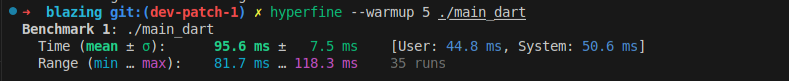

# Blazing Vector Sum Benchmarks

This repository contains simple implementations of vector addition in five programming languages: C++, Go, Python, Rust, and Dart. Each program creates two large vectors (10 million elements), sums them element-wise, and prints the last element of the result.

## Files

- [main.cpp](main.cpp): C++ implementation
- [main.go](main.go): Go implementation
- [main.py](main.py): Python implementation
- [main.rs](main.rs): Rust implementation
- [main.dart](main.dart): Dart implementation

## Usage

### C++

```sh
clang++  -std=c++17 -Ofast -march=native -flto main.cpp -o main_cpp
./main_cpp
```

### Python

```sh
python main.py
```

### Go

```sh
go build -o main_go main.go
```

### Rust

```sh
rustc -C opt-level=3 main.rs -o main_rs
./main_rs
```

### Dart

```sh
dart compile exe  main.dart --target-os linux  -o main_dart
./main_dart
```


### Performance Results




*Figure 1: Execution time comparison across languages*